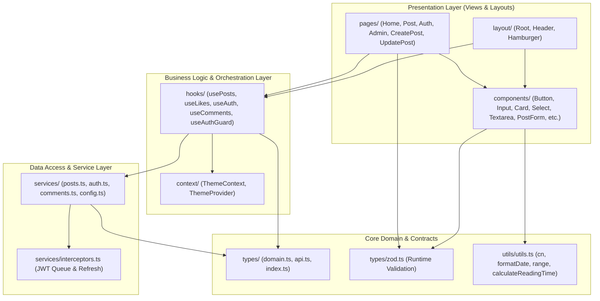
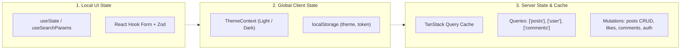
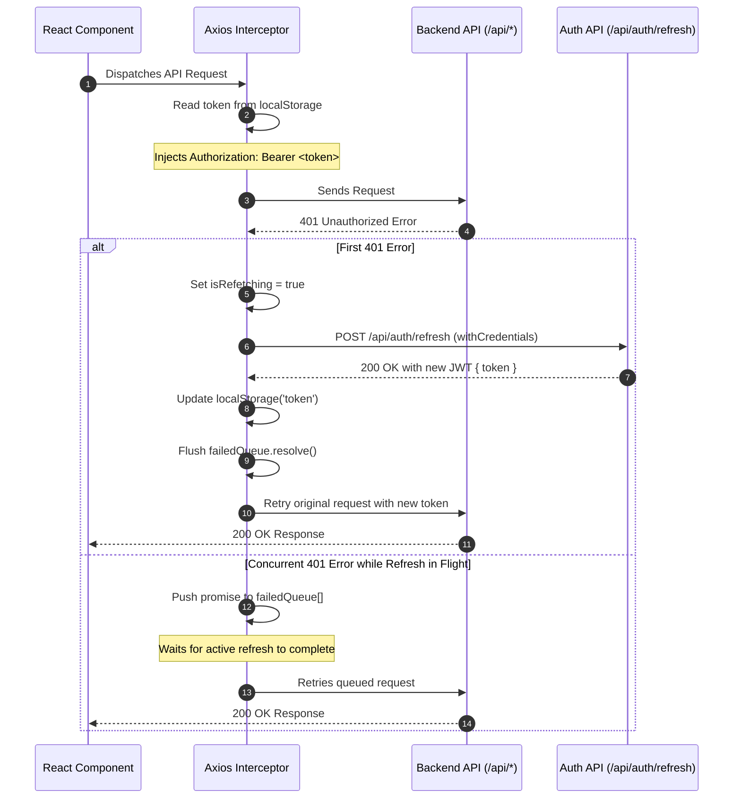
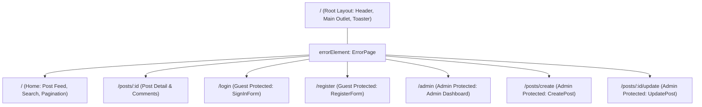
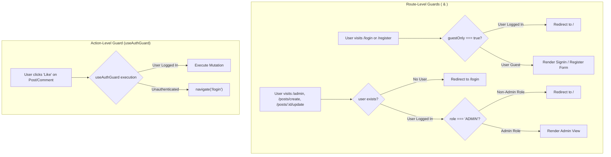

# Frontend Architecture Documentation

This document provides a comprehensive technical breakdown of the architecture, design patterns, data flows, state management paradigms, and code conventions used in the **Blog Client** application.

---

## 1. Folder Structure

The `src/` directory is organized using a layered, domain-aware structure where concerns are separated into dedicated, single-responsibility directories:

```
src/
├── assets/                  # Static media and graphics
├── components/              # Shared, reusable UI primitives & base design system elements
│   ├── AdminRoute.tsx       # Route-level admin authorization guard wrapper
│   ├── Button.tsx           # Polymorphic / variant-styled button (CVA)
│   ├── Card.tsx             # Post preview article card with like action
│   ├── ErrorMessage.tsx     # Standardized inline error message text
│   ├── ErrorPage.tsx        # Router error boundary fallback view
│   ├── FailedToLoad.tsx     # Generic error container with retry action
│   ├── Input.tsx            # Styled and unstyled form input field
│   ├── Label.tsx            # Accessible form label and label wrappers
│   ├── Like.tsx             # Interactive like toggle button with heart icon
│   ├── Pagination.tsx       # Numbered and ellipsis-aware pagination controls
│   ├── PostForm/            # Modular post creation and edit form compound components
│   │   ├── ContentEditorField.tsx # Markdown editor with write/preview tabs & formatting toolbar
│   │   ├── DescriptionField.tsx   # Post excerpt / description textarea field
│   │   ├── ImageUploadField.tsx   # Drag-and-drop cover image file upload with preview
│   │   ├── index.ts         # Barrel export for PostForm components
│   │   ├── PostForm.tsx     # Root form container with two-column layout & validation
│   │   ├── PublishCard.tsx  # Sticky sidebar card with publish/draft actions & checklist
│   │   ├── StateField.tsx   # Post publication visibility dropdown select
│   │   ├── TitleField.tsx   # Post headline text input field
│   │   └── types.ts         # Form field prop interfaces
│   ├── ProtectedRoute.tsx   # Route-level authentication guard wrapper
│   ├── Select.tsx           # Styled and unstyled form select dropdown
│   ├── Spinner.tsx          # Animated loading spinner indicator
│   └── Textarea.tsx         # Styled and unstyled multi-line textarea field
├── context/                 # React Context definitions and providers for global UI state
│   └── Theme/
│       ├── ThemeContext.ts  # Theme context contract and default state
│       ├── ThemeContext.types.ts # Theme types and context interface definitions
│       └── ThemeProvider.tsx# Theme persistence (localStorage, system preference)
├── hooks/                   # Reusable custom React hooks & Query/Mutation abstractions
│   ├── useAuth.ts           # Authentication queries & mutations (login, register, user, logout)
│   ├── useAuthGuard.ts      # Action-level auth guard higher-order wrapper
│   ├── useComments.ts       # Comment queries and creation mutations
│   ├── useDebounce.ts       # Debounced state synchronization hook
│   ├── useLikes.ts          # Post and comment like toggle mutations
│   ├── usePagination.ts     # Range calculation and ellipsis formatting for pagination
│   ├── usePosts.ts          # Post CRUD query and mutation hooks (list, get, create, update, delete)
│   └── useTheme.ts          # Hook to consume ThemeContext
├── layout/                  # Persistent layout components and application shells
│   ├── Hamburger.tsx        # Mobile navigation toggle button
│   ├── Header.tsx           # Top navigation bar with theme switch, admin link, & auth actions
│   └── Root.tsx             # Root layout wrapper with Header, main Outlet, and Toaster
├── mocks/                   # Mock Service Worker (MSW) setup for tests and offline dev
│   ├── data/                # In-memory mock datasets (posts, comments, users)
│   │   ├── comments.ts
│   │   ├── posts.ts
│   │   └── users.ts
│   ├── handlers/            # Mock API endpoint handlers
│   │   ├── comments.ts
│   │   ├── index.ts
│   │   ├── likes.ts
│   │   ├── posts.ts
│   │   └── users.ts
│   └── node.ts              # MSW node server initialization for Vitest
├── pages/                   # Feature-specific page views and page-level subcomponents
│   ├── Admin/               # Admin dashboard and content management views
│   │   ├── Admin.tsx        # Admin dashboard with search, status filters, and post table
│   │   ├── AdminHeader.tsx  # Dashboard metrics overview header (total, published, drafts, hidden)
│   │   ├── AdminToolbar.tsx # Search input, status filter buttons, and create post button
│   │   ├── index.ts         # Barrel export for Admin components
│   │   ├── PostTable.tsx    # Tabular post listing with empty state fallback
│   │   ├── PostTableRow.tsx # Table row with post metadata, edit navigation, and delete action
│   │   ├── StatusBadge.tsx  # Color-coded badge for publication states
│   │   └── types.ts         # Admin view interfaces and filter types
│   ├── Auth/                # Authentication views
│   │   ├── RegisterForm.tsx # User registration view with Zod validation
│   │   └── SignInForm.tsx   # User login view with credentials and OAuth buttons
│   ├── CreatePost/          # Post creation view
│   │   └── CreatePost.tsx   # Post creation page integrating PostForm with useCreatePost
│   ├── Home/                # Main feed / homepage view
│   │   ├── Footer.tsx       # Newsletter subscription footer
│   │   ├── Home.tsx         # Feed page with search, post grid, and pagination
│   │   └── NoPosts.tsx      # Empty state fallback
│   ├── Post/                # Post detail and discussion view
│   │   ├── Comment.tsx      # Individual comment card with like action
│   │   ├── CommentForm.tsx  # Comment creation form with React Hook Form
│   │   ├── CommentsSection.tsx # Comment list with pagination & optimistic preview
│   │   ├── Post.tsx         # Post view container with sticky action header
│   │   └── PostMain.tsx     # Post content rendered with React Markdown & typography
│   └── UpdatePost/          # Post edit view
│       └── UpdatePost.tsx   # Post update page preloaded with post data and useUpdatePostById
├── services/                # Low-level HTTP requests and Axios client configuration
│   ├── auth.ts              # Authentication API endpoints (login, register, me, logout)
│   ├── commentLikes.ts      # Comment like toggle endpoint
│   ├── comments.ts          # Comment fetching and creation endpoints
│   ├── config.ts            # Axios instance configuration and baseURL definition
│   ├── interceptors.ts      # Token injection, 401 interception, and refresh queue logic
│   ├── postLikes.ts         # Post like toggle endpoint
│   └── posts.ts             # Post CRUD endpoints (getPosts, getPostById, createPost, updatePostById, deletePostById)
├── tests/                   # Vitest unit and integration test suites
│   ├── components/          # Component rendering, interaction, and PostForm field unit tests
│   ├── hooks/               # Custom hook test suites (useTheme, useDebounce)
│   ├── pages/               # Page integration tests (Home, Admin, CreatePost, UpdatePost, Post, Auth)
│   ├── utils/               # Utility function unit tests (formatDate, readingTime, word/line counters)
│   ├── header.test.tsx      # Header navigation, admin link, and auth action tests
│   ├── setup.ts             # Global test environment and MSW lifecycle setup
│   └── testUtils.tsx        # Test render wrappers with QueryClient and Router
├── types/                   # TypeScript interface definitions and Zod schemas
│   ├── api.ts               # API response contracts, PaginatedResponse, and error structures
│   ├── domain.ts            # Core domain entities (Post, Comment, User, PostState, UserRole)
│   ├── index.ts             # Barrel export combining api and domain types
│   ├── react-invoker.d.ts   # HTML button invoker type augmentations
│   └── zod.ts               # Runtime validation schemas (Auth, Comments, Post forms)
├── utils/                   # Shared pure utility functions
│   └── utils.ts             # `cn` helper, `formatDate`, `range`, `blogApi`, `calculateReadingTime`, `wordsAmountFor`, `linesAmountFor`
├── App.tsx                  # Router definitions, QueryClientProvider, Devtools
├── index.css                # Tailwind CSS v4 directives, design tokens, color theme variables
└── main.tsx                 # React DOM root mounting and top-level provider wrapping
```

---

## 2. Code Organization Pattern

The project implements a **Layered Architecture** complemented by **Feature-Oriented Page Decomposition**.



### Architectural Boundaries and Dependency Rules

1. **Unidirectional Dependency Flow**:
   - UI views (`pages/`, `layout/`, `components/`) depend on abstraction hooks (`hooks/`) and utility functions (`utils/`).
   - UI views **never** invoke the raw Axios instance or make direct HTTP calls.
   - Custom hooks (`hooks/`) coordinate state using TanStack Query and call pure API service methods (`services/`).
   - Services (`services/`) are pure asynchronous functions that serialize and deserialize data via Axios against strongly-typed contracts (`types/`).

2. **Feature Colocation for Page Subcomponents**:
   - Page-specific elements reside in their respective feature folder under `src/pages/{Feature}/` (e.g., `AdminToolbar.tsx`, `PostTable.tsx`, `PostTableRow.tsx`, and `StatusBadge.tsx` inside `src/pages/Admin/`; `CommentForm.tsx` and `CommentsSection.tsx` inside `src/pages/Post/`).
   - Domain-agnostic primitives and reusable form systems live in `src/components/` (e.g., `Button`, `Input`, `Select`, `Textarea`, `Pagination`, and the compound `PostForm/`).

3. **Path Aliasing**:
   - The `@/*` alias is mapped to `src/*` (configured in both `tsconfig.app.json` and `vite.config.ts`), preventing deep relative path imports (`../../..`).

---

## 3. State Management

The application categorizes and isolates state into three distinct tiers:



### 1. Local UI State

- **React Primitives (`useState`)**: Used for transient component states such as the mobile menu toggle in `Header.tsx`, local search inputs in `Home.tsx` and `Admin.tsx`, tab selection (`write` vs `preview`) in `ContentEditorField.tsx`, file drag-and-drop state in `ImageUploadField.tsx`, and comment pagination tracking in `CommentsSection.tsx`.
- **URL Search Parameters (`useSearchParams`)**: Synchronizes search term (`search`), pagination (`page`), and publication status filters (`state`) with browser history and URL query strings in `Home.tsx` and `Admin.tsx`.
- **Form State (`react-hook-form` + `@hookform/resolvers/zod`)**: Manages form field values, dirty/touched states, and validation errors across authentication forms (`SignInForm.tsx`, `RegisterForm.tsx`), comment submission (`CommentForm.tsx`), and post authoring/editing (`PostForm.tsx` with `createPostSchema` and `updatePostSchema`).

### 2. Global Client State

- **React Context API (`ThemeContext`, `ThemeProvider`)**:
  - Controls active application theme (`light` | `dark`).
  - Initializes state by evaluating `localStorage.getItem('theme')` with a fallback to `window.matchMedia('(prefers-color-scheme: dark)')`.
  - Automatically synchronizes the `.dark` CSS class on `document.documentElement` and persists updates to `localStorage`.

### 3. Server State and Caching (TanStack Query v5)

- **Caching & Stale Time**: Server data is fetched, cached, and synchronized using `@tanstack/react-query`.
- **Pagination & Query Stability**: `usePosts` and `useCommentsByPostId` leverage `placeholderData: keepPreviousData` to prevent UI layout shift and flickering during page transitions or search query updates.
- **Cache Invalidation & Revalidation**:
  - `useCreatePost`, `useDeletePostById`, and `useTogglePostLikes` invalidate the `['posts']` query key upon mutation success.
  - `useUpdatePostById` handles post modification submissions.
  - `useToggleCommentLikes` and `useCreateComment` invalidate `['post', postId, 'comments']`.
  - `useLogin` and `useLogout` trigger cache resets/invalidation for user queries via `queryClient.resetQueries()`.
- **In-flight Optimistic UI Feedback**: `CommentsSection.tsx` uses `useMutationState` filtered by `mutationKey: ['createComment']` and `status: 'pending'` to render pending comments in the UI before server confirmation.

---

## 4. Data Fetching and API Integration

### HTTP Client Setup & Base URL

All HTTP communication is routed through a centralized Axios instance configured in `src/services/config.ts`:

```typescript
export const blogApi: AxiosInstance = axios.create({
  baseURL: 'https://blog-api-65st.onrender.com',
  timeout: 5000,
  withCredentials: true,
});
```

- `withCredentials: true` enables the browser to send and receive HTTP-only refresh cookies across origins.
- `timeout: 5000` enforces a 5-second timeout window.

### Request & Response Interceptors (JWT + Refresh Flow)

The interceptor pipeline in `src/services/interceptors.ts` handles Bearer token injection and concurrent refresh queuing:



#### Refresh Token Queuing Mechanism:

1. **Request Interceptor**: Reads `localStorage.getItem('token')` and appends `Authorization: Bearer ${token}`.
2. **401 Interception**: When a request fails with `401 Unauthorized`, it checks if the URL is in the skip list (`/auth/register`, `/auth/login`) or if it was already retried (`_retry`).
3. **Concurrency Lock (`isRefetching`)**:
   - If a refresh is already in progress, subsequent failing requests are added to `failedQueue: QueueItem[]`.
   - The initial request triggers `POST /api/auth/refresh`.
4. **Queue Resolution**:
   - **On Success**: The new token is saved to `localStorage`, `processQueue(null, newToken)` resolves all queued requests, and the original requests are re-executed.
   - **On Failure**: `processQueue(refreshError)` rejects all queued promises, removes the invalid token from `localStorage`, and bubbles up the error to trigger re-authentication.

### Request Cancellation

All query service functions (`getPosts`, `getPostById`, `getCommentsByPostId`) accept an `AbortSignal` from TanStack Query's `queryFnContext` and forward it to Axios, enabling automatic request abortion when queries become inactive or search terms change.

### Error Handling Strategy

- **Service Layer**: Normalizes Axios error payloads using `isAxiosError<ApiError>(err)` to extract backend error messages (`err.response.data.message`).
- **Route Error Boundary**: Unhandled runtime and routing errors are caught by `ErrorPage.tsx` attached to React Router's `errorElement`.
- **Component Feedback**: Handled with `FailedToLoad` for inline retry actions, form field error messages (`ErrorMessage`), and `sonner` toast notifications (`toast.success`, `toast.error`) for feedback on mutations.

---

## 5. Routing and Navigation

Routing is configured using React Router v8 (`createBrowserRouter`) in `src/App.tsx`:



### Route Structure

- **Root Layout (`src/layout/Root.tsx`)**: Wraps the entire application with a fixed `Header`, dynamic `<Outlet />`, and the global `Toaster` for notifications.
- **Nested Error Boundary (`src/components/ErrorPage.tsx`)**: Placed within the root route to catch route rendering errors without unmounting navigation headers.

### Route Guarding Strategies

The application uses two distinct levels of authentication and authorization protection:



1. **Declarative Route Guards**:
   - **`<ProtectedRoute />`**:
     - `guestOnly={true}`: Protects auth routes (`/login`, `/register`). If a user is already authenticated (determined via `useUser()`), they are redirected to `/`.
     - `guestOnly={false}`: Protects standard private routes. Redirects unauthenticated visitors to `/login`.
   - **`<AdminRoute />`**:
     - Protects admin and post management routes (`/admin`, `/posts/create`, `/posts/:id/update`).
     - Redirects unauthenticated visitors to `/login`.
     - Verifies user authorization (`user.role === 'ADMIN'`) and redirects non-admin users to `/`.

2. **Imperative Action Guard (`useAuthGuard`)**:
   - A higher-order function returned by `useAuthGuard()`.
   - Wraps sensitive UI actions (such as liking a post in `Home.tsx` or `Post.tsx`, or submitting comments) to automatically redirect unauthenticated users to `/login` before dispatching mutations.

---

## 6. Shared Utilities and Types

### 1. Reusable UI Components (`src/components/`)

Built with `@/utils/utils.ts` (`cn`) and `class-variance-authority` (CVA) for strict variant typing:

| Component                | Purpose & Description                                           | Variants / Props                                                 |
| :----------------------- | :-------------------------------------------------------------- | :--------------------------------------------------------------- |
| `Button`                 | Standardized interactive button                                 | `intent: 'primary' \| 'secondary'`, `size: 'xs' \| 'sm' \| 'md'` |
| `Input`                  | Styled form text, search, or password input                     | `intent: 'primary' \| 'unstyled'`                                |
| `Textarea`               | Styled multi-line text input field                              | `intent: 'primary' \| 'unstyled'`                                |
| `Select`                 | Styled dropdown select menu                                     | `intent: 'primary' \| 'unstyled'`                                |
| `Label` / `LabelWrapper` | Accessible label and wrapper with focus ring                    | `intent: 'primary' \| 'secondary'`, `size: 'sm' \| 'md' \| 'xl'` |
| `Card`                   | Post teaser card with cover image & like button                 | Accepts `img`, `title`, `description`, `likes`, `isLiked`, `onLikeClick` |
| `Like`                   | Heart button displaying count and active like status            | `likes`, `isLiked`, `onLikeClick`                                |
| `Pagination`             | Accessible pagination bar with sliding sibling range            | `totalPages`, `currentPage`, `handleChangePage`                  |
| `Spinner`                | CSS keyframe animated loading spinner                           | `className`, `testId`                                            |
| `ErrorMessage`           | Form error text helper                                          | `size: 'sm' \| 'base' \| 'md'`                                   |
| `FailedToLoad`           | Error placeholder card with retry action button                 | `isPending`, `refetch`, `title`, `className`                     |
| `ProtectedRoute`         | Route guard component for guest/user protection                 | `guestOnly?: boolean`, `children`                                |
| `AdminRoute`             | Route guard component restricting access to `ADMIN` users       | `children`                                                       |
| `PostForm`               | Compound form component for creating and editing blog posts     | `onSubmit`, `isPending`, `initialValues`, `isEdit`               |

### 2. Custom Hooks (`src/hooks/`)

- **`usePosts(search, page, state)`**: Fetches paginated post lists with debounced query parameters and publication state filtering (`PUBLISHED`, `HIDDEN`, `DRAFT`).
- **`usePostById(id)`**: Fetches a single post by ID; throws errors to the router error boundary.
- **`useCreatePost()`**: Mutation hook to create a new post with multipart `FormData`; invalidates `['posts']`.
- **`useUpdatePostById()`**: Mutation hook to update an existing post with multipart `FormData`.
- **`useDeletePostById()`**: Mutation hook to delete a post by ID; invalidates `['posts']`.
- **`useCommentsByPostId(id, page)`**: Fetches paginated comments for a target post.
- **`useCreateComment(user)`**: Submits a new comment and triggers query invalidation.
- **`useTogglePostLikes()` / `useToggleCommentLikes({ postId })`**: Toggles likes and manages cache invalidation.
- **`useAuth` (`useLogin`, `useRegister`, `useUser`, `useLogout`)**: TanStack Query wrappers for user authentication.
- **`useAuthGuard()`**: Higher-order execution guard redirecting unauthenticated users to `/login`.
- **`useDebounce<T>(value, delay)`**: Debounces fast-changing state (e.g. search input).
- **`usePagination(params)`**: Generates an array of page numbers and `'...'` ellipsis placeholders using a sibling-window algorithm.
- **`useTheme()`**: Shorthand for consuming `ThemeContext`.

### 3. Utility Helpers (`src/utils/utils.ts`)

- **`cn(...inputs: ClassValue[])`**: Combines `clsx` and `tailwind-merge` to resolve conflicting Tailwind utility classes cleanly.
- **`formatDate(date, fallback)`**: Formats ISO date strings, `Date` objects, or timestamps using `Intl.DateTimeFormat` (`en-US`).
- **`range(start, end)`**: Generates contiguous integer arrays for pagination ranges.
- **`blogApi(path)`**: Constructs fully-qualified API URLs against the backend base URL.
- **`calculateReadingTime(wordsAmount)`**: Estimates reading duration in minutes based on average 250 words per minute.
- **`wordsAmountFor(str)`**: Computes the word count of a string by splitting whitespace.
- **`linesAmountFor(str)`**: Computes the line count of a string across newline delimiters.

### 4. Global TypeScript Types & Validation Schemas (`src/types/`)

- **`src/types/domain.ts`**:
  - Core domain models: `Post`, `Comment`, `User`, `PostState` (`'PUBLISHED' | 'HIDDEN' | 'DRAFT'`), `UserRole` (`'ADMIN' | 'USER' | 'EDITOR'`).
- **`src/types/api.ts`**:
  - API response and request types: `PaginatedResponse<T>`, `AuthResponse`, `LoginResponse`, `RegisterResponse`, `LogoutResponse`, `ToggleLikeRequest`, `DeletePostResponse`.
  - Error structures: `ApiError`, `ApiErrorDetails`.
- **`src/types/index.ts`**:
  - Barrel export aggregating `domain.ts` and `api.ts`.
- **`src/types/zod.ts`**:
  - Schema definitions: `signInSchema`, `registerSchema`, `createCommentSchema`, `postSchema`, `createPostSchema`, `updatePostSchema`.
  - Static type inference: `SignInRequest`, `RegisterRequest`, `CreateCommentFormValues`, `CreateCommentRequest`, `PostFormValues`, `CreatePostForm`, `UpdatePostForm`.
- **`src/types/react-invoker.d.ts`**:
  - Ambient type augmentation enabling HTML Invoker Commands (`command`, `commandfor`) on `<button>` elements.

---

## 7. Key Dependencies

| Dependency                                   | Category           | Role in Architecture                                                                    |
| :------------------------------------------- | :----------------- | :-------------------------------------------------------------------------------------- |
| **`react` (v19) & `react-dom`**              | Core Framework     | Component lifecycle, virtual DOM rendering, and root mount.                             |
| **`typescript` (v6)**                        | Language           | Static type safety, interfaces, module resolution, and autocompletion.                  |
| **`vite` (v8)**                              | Build Tooling      | Development server, HMR, bundling, and path alias resolution.                           |
| **`react-router` (v8)**                      | Routing            | Client-side declarative routing, nested layouts, and route boundaries.                  |
| **`@tanstack/react-query` (v5)**             | Server State       | Async data fetching, caching, deduplication, and cache invalidation.                    |
| **`@tanstack/react-query-devtools`**         | Developer Tooling  | Visual inspection of query caches, mutation statuses, and query states.                 |
| **`axios`**                                  | HTTP Client        | HTTP communication, timeout management, credentials, and interceptor pipeline.          |
| **`react-hook-form`**                        | Form Handling      | Uncontrolled form inputs, performant validation subscriptions, and submission handling. |
| **`zod`**                                    | Validation         | Schema validation and compile-time TypeScript type inference for form inputs.           |
| **`@hookform/resolvers`**                    | Form Bridge        | Bridges Zod schemas directly into React Hook Form resolvers.                            |
| **`tailwindcss` (v4) & `@tailwindcss/vite`** | Styling Engine     | Utility-first styling with native CSS variables and theme configuration.                |
| **`@tailwindcss/typography`**                | Styling Plugin     | Automatic `prose` styling for parsed markdown article content.                          |
| **`class-variance-authority` (CVA)**         | Component Design   | Type-safe component variant generation for design system primitives.                    |
| **`clsx` & `tailwind-merge`**                | Style Utilities    | Conditional class concatenation and conflict-free Tailwind class resolution.            |
| **`react-markdown` & `remark-gfm`**          | Content Rendering  | Markdown parsing and GitHub Flavored Markdown (GFM) HTML rendering.                     |
| **`sonner`**                                 | User Notifications | Toast notification management for feedback on registration, CRUD, and actions.          |
| **`react-icons`**                            | Icons              | Vector icons from Lucide, Feather, Flat Color, and Ionicons libraries.                  |
| **`vitest` & `jsdom`**                       | Testing Engine     | Fast unit/integration test runner with DOM simulation environment.                      |
| **`@testing-library/react`**                 | UI Testing         | React component testing from the user's perspective.                                    |
| **`msw` (Mock Service Worker)**              | Network Mocking    | Intercepts HTTP requests at network level for deterministic testing.                    |
